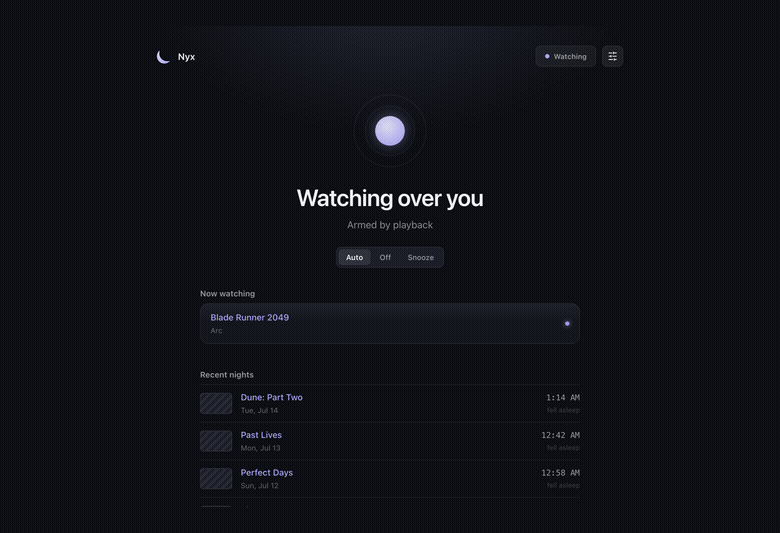
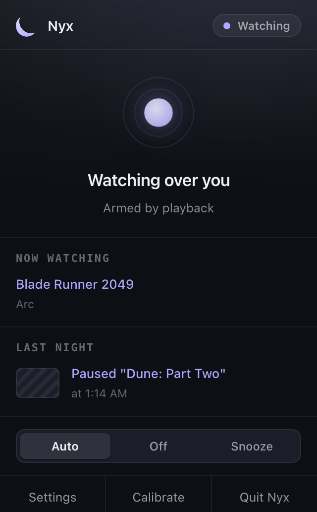
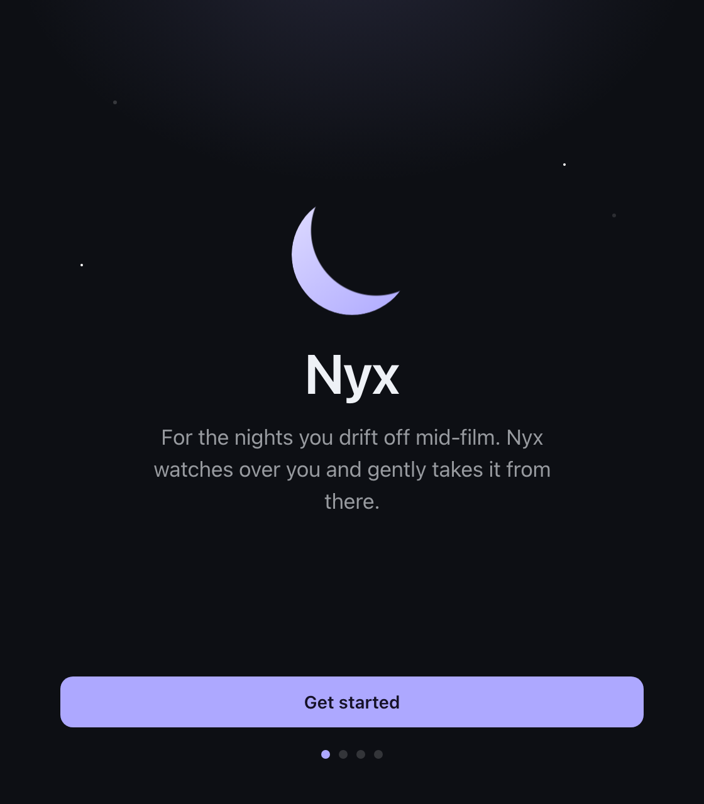
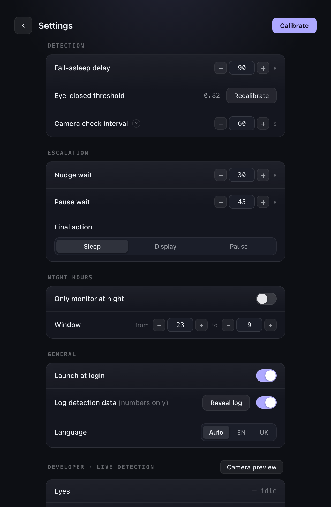
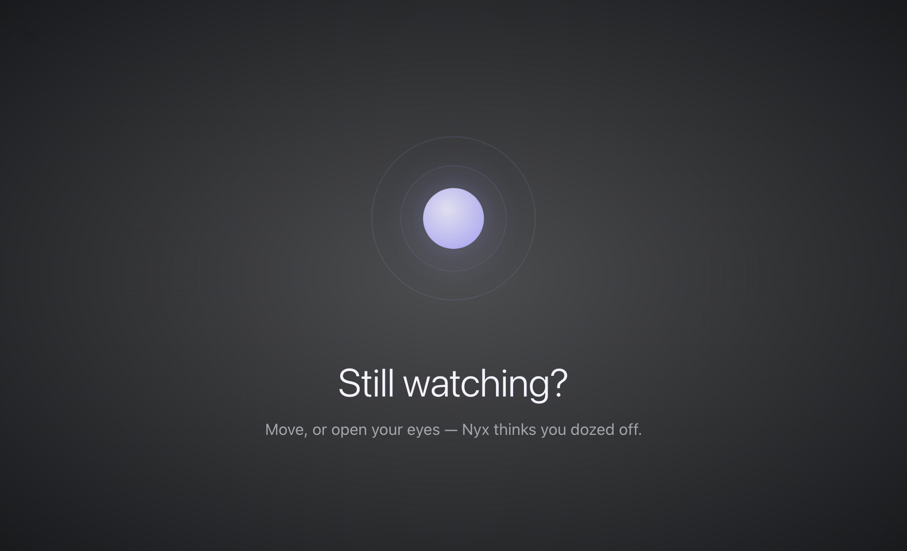

<div align="center">


# Nyx

**Fall asleep watching? Nyx catches you.**

A private macOS menu-bar app that notices when you doze off in front of a film,
gently nudges you, pauses playback, remembers where you stopped — and puts your
Mac to sleep if you don't answer.

[](https://github.com/mineo71/Nyx/releases/latest)
[](https://github.com/mineo71/Nyx/actions/workflows/ci.yml)


[](LICENSE)


</div>

<div align="center">
  
</div>

<table align="center">
  <tr>
    <td width="50%" valign="top"><br /><sub><b>Menu-bar popover</b> — the quick glance</sub></td>
    <td width="50%" valign="top"><br /><sub><b>Onboarding</b> — a privacy-first first run</sub></td>
  </tr>
  <tr>
    <td valign="top"><br /><sub><b>Settings</b> — grouped native controls + a live detection readout</sub></td>
    <td valign="top"><br /><sub><b>Nudge overlay</b> — a gentle “still watching?” over your film</sub></td>
  </tr>
</table>

---

## Why

You put on a series in bed, drift off, and wake up six episodes deep with no idea where you
stopped. Nyx watches for that moment — eyes closing, head dropping — and steps in: a soft
nudge, then pause, then, if you're truly gone, it sleeps the Mac. In the morning it tells you
exactly where you nodded off, with a link straight back to it.

Everything runs **on your machine**. The camera feed is analyzed in memory and **never saved
or uploaded**.

## Features

- 🌙 **On-device sleep detection** — eye-closure + drowsiness tracking (MediaPipe FaceLandmarker)
  with a windowed, hysteresis-based decision so blinks don't fool it and a stray frame won't
  reset it. Optional **head-nod** corroboration.
- 🎬 **Knows what's playing** — arms automatically when a video is *in sight* (browser, QuickTime,
  IINA, VLC), shows a **Now watching** row, and saves the **title + link** you dozed off to.
- 🪜 **Gentle escalation ladder** — quiet nudge → pause playback → louder nudge → sleep the Mac.
  Any movement or open eyes cancels it. Every timing is configurable.
- 🔦 **Camera-frugal** — the webcam only wakes when armed: a brief check every *N* seconds while
  watching (tunable), continuous only when confirming a doze. The green light stays dark otherwise.
- 🖥️ **Real Mac app** — a nocturnal menu-bar popover **and** a full dashboard with an in-app
  Settings page; close the window and it lives on quietly in the menu bar.
- ✋ **Manual override** — a **Start watching** button arms Nyx even with nothing playing.
- 🔬 **Live camera preview** — a developer view draws the face box, eye/iris landmarks and
  head-pose over your feed, tinted amber when your eyes read closed.
- 🎚️ **Calibration** — a quick eyes-open / eyes-closed wizard tunes detection to your face.
- 🌍 **English & Українська** — follows your system language, switchable in Settings.
- 🔒 **Private & offline** — no cloud, no accounts, no images stored. Optional numbers-only
  detection log, stored locally.

## How it works

```
 video in sight ──► arm camera ──► MediaPipe eye-blink + head-pose
                                        │
                           windowed drowsiness model (hysteresis + PERCLOS)
                                        │
           eyes closed long enough ──► escalation ladder
                nudge → pause → louder nudge → sleep Mac
                                        │
                    any input / eyes open ──► cancel
```

Detection lives in small, pure, unit-tested modules; the camera + OS glue is thin adapters
around Electron and macOS built-ins (`pmset`, `caffeinate`, AppleScript) plus a tiny Swift
media-key helper.

## Download & install

### Homebrew (recommended)

```bash
brew tap mineo71/nyx https://github.com/mineo71/Nyx
brew install --cask nyx
```

The cask strips the quarantine flag for you, so it launches straight away. `brew upgrade`
pulls new versions.

### Or download the DMG

**[⬇︎ Download the latest `.dmg` from Releases](https://github.com/mineo71/Nyx/releases/latest)**
(Apple Silicon). The build is **unsigned**, so on first launch: **right-click `Nyx.app` → Open**
(or System Settings → Privacy & Security → *Open Anyway*).

Then grant **Camera** and **Accessibility** when asked — Accessibility lets Nyx press the
media Play/Pause key.

### First run

Nyx walks you through a short setup — privacy, permissions, and a one-minute calibration
(eyes open ×10, eyes closed ×10). After that it lives in the menu bar.

## Build from source

**Requirements:** macOS (Apple Silicon), Node 20+.

```bash
git clone https://github.com/mineo71/Nyx.git
cd Nyx
npm install
npm start            # builds CSS, then launches the app
```

Package a distributable:

```bash
npm run dist         # → dist/Nyx-<version>-arm64.dmg  (unsigned)
```

## Usage

1. Menu-bar crescent → the popover. Play something → it flips to **Watching** and shows the title.
2. Doze off → Nyx nudges, pauses, and (if configured) sleeps the Mac.
3. Next morning, **Last night / Recent nights** show where you stopped — click to reopen the link.

Tune everything in **Settings**: fall-asleep delay, camera check interval, ladder timings,
final action (sleep / display-off / pause-only), night hours, launch-at-login, language.
The **Developer** section has a live detection readout and a **Camera preview** with overlays.

## Privacy

- Webcam frames are processed in memory and **never written to disk or sent anywhere**.
- The only persisted data: your calibration threshold, settings, a text recap (title + link +
  time), and (if enabled) a **numbers-only** detection log
  (`~/Library/Application Support/nyx/`).
- Fully offline. No telemetry.

## Tech

Electron · MediaPipe Tasks Vision · Tailwind CSS · Lucide · Vitest · a little Swift.

## Contributing

Issues and PRs welcome — see [CONTRIBUTING.md](CONTRIBUTING.md). `npm test` runs the unit
suite (pure logic, no hardware needed).

## Roadmap

- Owner-only detection when more than one face is in frame.
- A personal, trained detection model once enough local data is collected.
- Better low-light detection (a normal webcam can't see in the dark — needs IR).

## License

[MIT](LICENSE) © 2026 Oleh Rylskyj

<div align="center"><sub>Named for Nyx, the Greek goddess of night. 🌙</sub></div>
